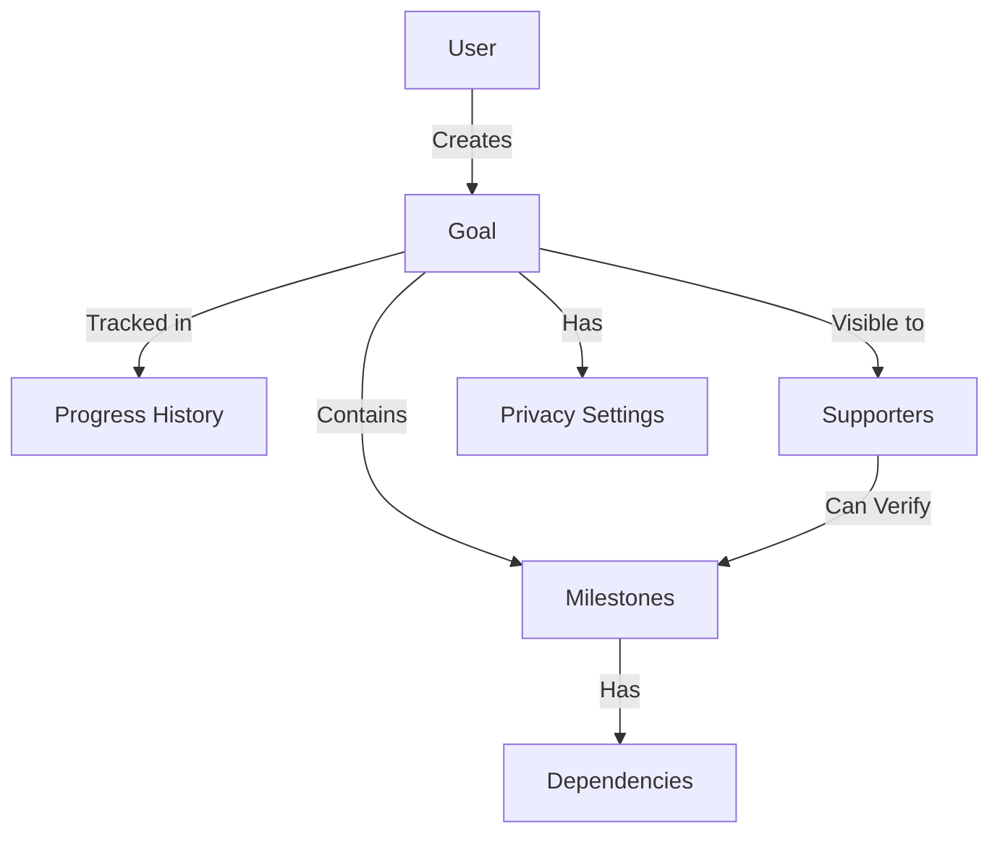

# GoalGrid Progress Tracker

A decentralized smart contract system for tracking and managing personal goals with nested milestones, dependencies, and social accountability features.

## Overview

GoalGrid enables users to break down complex personal goals into manageable steps while maintaining an immutable record of their progress. The system provides:

- Creation and management of personal goals with nested milestones
- Customizable privacy settings for goals (private, supporter-only, or public)
- Social accountability through supporter verification
- Immutable progress history tracking
- Milestone dependencies and hierarchical goal structures

## Architecture

The GoalGrid system is built around a core contract that manages goals, milestones, and progress tracking. Here's how the components interact:



### Core Components

1. **Goals**: The main structure for tracking objectives
2. **Milestones**: Subdivisions of goals with individual progress tracking
3. **Dependencies**: Relationships between milestones
4. **Progress History**: Immutable record of all updates
5. **Supporter System**: Social accountability framework

## Contract Documentation

### Main Data Structures

- `goals`: Stores goal metadata and completion status
- `milestones`: Tracks individual milestones within goals
- `milestone-dependencies`: Manages relationships between milestones
- `goal-supporters`: Tracks authorized supporters and their permissions
- `progress-history`: Maintains an immutable record of all progress updates

### Privacy Levels

1. `PRIVACY-PRIVATE` (u1): Only owner can view
2. `PRIVACY-SUPPORTERS` (u2): Owner and designated supporters can view
3. `PRIVACY-PUBLIC` (u3): Anyone can view

## Getting Started

### Prerequisites

- Clarinet
- Stacks wallet for deployment

### Basic Usage

1. Create a new goal:
```clarity
(contract-call? .goal-grid create-goal 
    "goal-1" 
    "Learn Clarity" 
    "Master Clarity smart contract development" 
    none 
    u2)
```

2. Add a milestone:
```clarity
(contract-call? .goal-grid add-milestone
    "goal-1"
    "milestone-1"
    "Complete basic tutorial"
    "First milestone in learning Clarity"
    none
    none
    "Submit working example contract")
```

3. Update progress:
```clarity
(contract-call? .goal-grid update-milestone-progress
    "goal-1"
    "milestone-1"
    u50
    "Completed half of the tutorial")
```

## Function Reference

### Goal Management

```clarity
(create-goal (goal-id (string-ascii 32)) 
            (title (string-ascii 100)) 
            (description (string-utf8 500))
            (target-date (optional uint))
            (privacy uint))

(update-goal-privacy (goal-id (string-ascii 32)) 
                    (privacy uint))
```

### Milestone Management

```clarity
(add-milestone (goal-id (string-ascii 32))
              (milestone-id (string-ascii 32))
              (title (string-ascii 100))
              (description (string-utf8 500))
              (target-date (optional uint))
              (parent-milestone (optional (string-ascii 32)))
              (verification-criteria (string-utf8 300)))

(update-milestone-progress (goal-id (string-ascii 32))
                         (milestone-id (string-ascii 32))
                         (new-percentage uint)
                         (notes (string-utf8 300)))
```

### Supporter Functions

```clarity
(add-goal-supporter (goal-id (string-ascii 32))
                   (supporter principal)
                   (can-view bool)
                   (can-verify bool))

(verify-milestone-progress (owner principal)
                         (goal-id (string-ascii 32))
                         (milestone-id (string-ascii 32))
                         (verification-notes (string-utf8 300)))
```

## Development

### Testing

1. Clone the repository
2. Install Clarinet
3. Run tests:
```bash
clarinet test
```

### Local Development

1. Start Clarinet console:
```bash
clarinet console
```

2. Deploy contract:
```bash
clarinet deploy
```

## Security Considerations

1. **Progress Immutability**: All progress updates are recorded in an immutable history
2. **Access Control**: Goals have configurable privacy settings
3. **Supporter Verification**: Only authorized supporters can verify progress
4. **Limitations**:
   - Maximum 100 goals per user
   - Maximum 100 milestones per goal
   - Maximum 100 progress history entries per goal

### Best Practices

- Always verify supporter permissions before sharing sensitive goals
- Regularly monitor progress history for unauthorized changes
- Set appropriate privacy levels based on goal sensitivity
- Consider milestone dependencies when planning goal structure